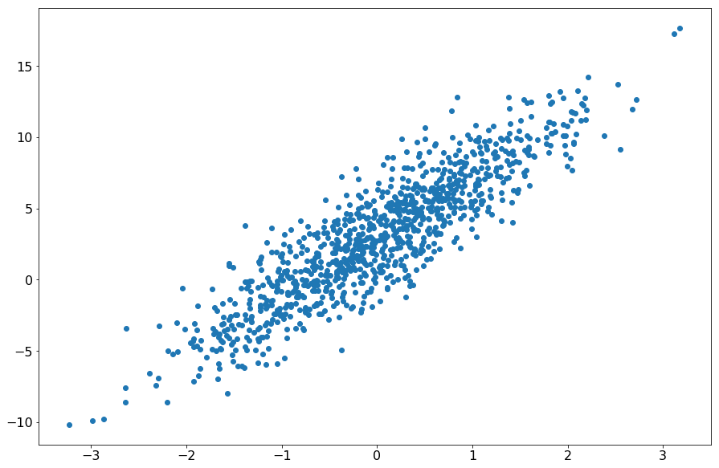
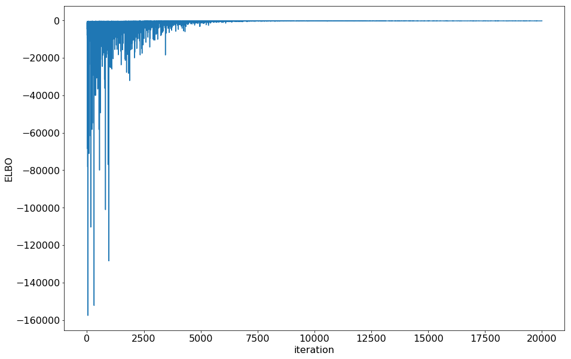
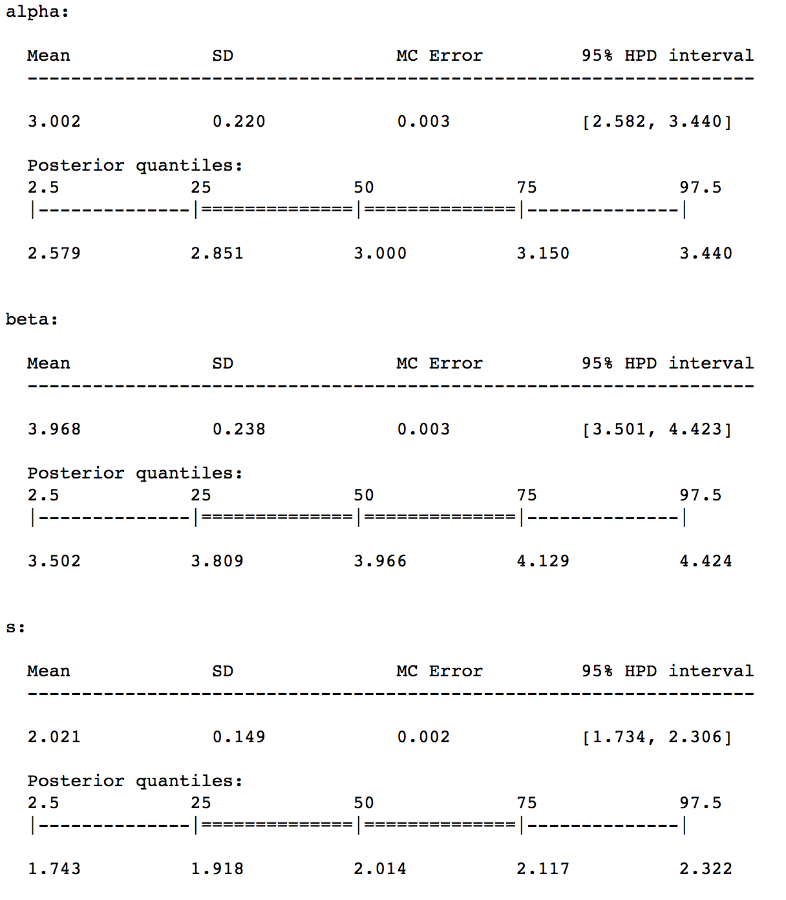
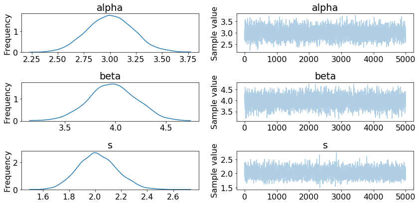

Getting Started
========================================

This section is adapted from my `2017 PyData NYC talk <https://www.youtube.com/watch?v=zGRnirbHWJ8&list=PLGVZCDnMOq0oqs6RTJk4zZde86DZrgnzm&index=13>`__. 

To demonstrate how to get started with PyMC3 Models, I'll walk through a simple Linear Regression example. First, I'll go through the example using just PyMC3. Then I'll show you the same example using PyMC3 Models.

Generate Synthetic Data
------------------------
::

    X = np.random.randn(1000, 1)
    noise = 2 * np.random.randn(1000, 1)
    Y = 4 * X + 3 + noise

Fit a model with PyMC3
-----------------------

Step 1: Set up the PyMC3 model
+++++++++++++++++++++++++++++++++++++++
::

    lin_reg_model = pm.Model()

    model_input = theano.shared(X)

    model_output = theano.shared(Y)

    with lin_reg_model:

        alpha = pm.Normal('alpha', mu=0, sd=100, shape=(1))
        beta = pm.Normal('beta', mu=0, sd=100, shape=(1))
        
        s = pm.HalfNormal('s', tau=1)
        
        mean = alpha + beta * model_input

        y = pm.Normal('y', mu=mean , sd=s, observed=model_output)

Step 2: Infer your parameters
+++++++++++++++++++++++++++++++++++++++
::

    with lin_reg_model:
        inference = pm.ADVI()
        approx = pm.fit(
            n=20000, 
            method=inference, 
            more_replacements={
                model_input: pm.Minibatch(X), 
                model_output: pm.Minibatch(Y)
            }
        )

Check if minibatch ADVI converged by plotting the ELBO

::
    
    plt.plot(-inference.hist)
    plt.ylabel('ELBO')
    plt.xlabel('iteration')

Step 3: Interpret your parameters
+++++++++++++++++++++++++++++++++++++++
To make things a bit easier, I draw samples from the approximation to generate a trace.

::

    trace = approx.sample(draws=5000)
    summary(trace)

   
::

    traceplot(trace)

Step 4: Predict data by creating posterior predictive samples
++++++++++++++++++++++++++++++++++++++++++++++++++++++++++++++++++++++++++++++
::

    ppc = pm.sample_ppc(
        trace[1000:],
        model=lin_reg_model,
        samples=2000
    )
    pred = ppc['y'].mean(axis=0)
    r2_score(Y, pred)
    0.79444136879972738

Fit a model with PyMC3 Models
----------------------------------------------
Now, we can build a Linear Regression model using PyMC3 models.

The following is equivalent to Steps 1 and 2 above.

::

    LR = LinearRegression()
    LR.fit(X, Y, minibatch_size=100)
    LR.plot_elbo()

The following is equivalent to Step 3 above. 
Since the trace is saved directly, you can use the same PyMC3 functions (summary and traceplot).

:: 

    traceplot(LR.trace)

The following is equivalent to Step 4.

::

    Y_predict = LR.predict(X)
    LR.score(X, Y)

The same type of model can be fit in fewer lines, and the model class follows the scikit-learn API.

If you want a point estimate, you can use the saved summary dataframe:

::

    beta = LR.summary['mean']['betas__0_0']
    alpha = LR.summary['mean']['alpha__0']

Advanced
----------
Saving and Loading your model
++++++++++++++++++++++++++++++++++++++++++++++++++

::

    LR.save('pickle_jar/LR_jar/')
    LR2 = LinearRegression()
    LR2.load('pickle_jar/LR_jar/')

NUTS Inference
+++++++++++++++++++++++++
The default method of inference for PyMC3 models is minibatch ADVI. This is typically much faster than other methods. However, in some cases, you may want to use the NUTS sampler.

::

    LR3 = LinearRegression()
    LR3.fit(X, Y, inference_type='nuts', inference_args={'draws': 2000})

Now you can use the predict, score methods, etc as above.

Inference Args
+++++++++++++++++++++++++
If you don't want to use the default arguments for inference, you can pass in inference_args. Check out the `PyMC3 documentation <http://docs.pymc.io/>`__ for permissible values for the inference_type you are using.

Building your own models
+++++++++++++++++++++++++
Lastly, if you want to build your own models, you can build them on top of the BayesianModel base class.
